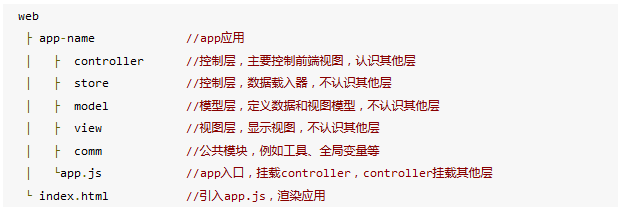

### AngularJs  
> 前言：  
#### * 宏观的介绍构建自己的Web-app  
ExtJS在最初2.0构想出MVC设计模式的时候，仅仅只是有示例给出，但后来就在官网追加了基于ExtJS-MVC的具体实现流程，该流程很清晰完整的阐明了作为一个最小化app所应该拥有的结构。  
  
#### * 关于AngularJS指令及过滤器  
    E - 指令可以作为HTML元素使用
    A - 指令可以作为HTML属性使用
    C - 指令可以作为CSS类使用
    M - 指令可以在HTML注释中使用 
过滤器可以使用一个管道字符（|）添加到表达式和指令中 。  
另安利：  
* 讲解AngularJS架构：http://briantford.com/blog/huuuuuge-angular-apps  
* 资料推荐：  
    1. egghead.io，比较全面的视频教程，作者为JebBrains WebStorm的员工  
    2. yeoman.io，开发流程工具；  
    3. http://www.youtube.com/feed/UCbn1OgGei-DV7aSRo_HaAiw，AngularJs的官方YouTube Channel;  
    4. angular-app，Github上一个Angular CRUD application demo，很不错的例子，更新的也很活跃
